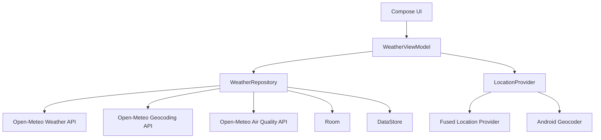
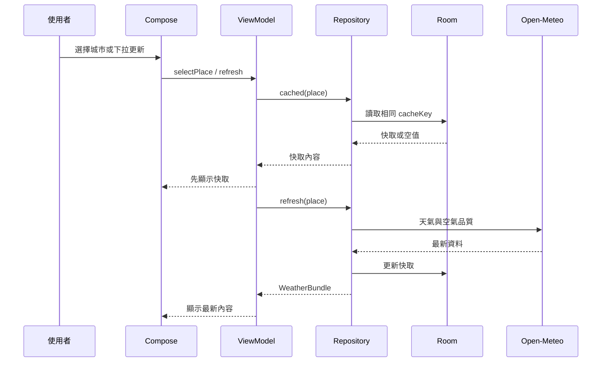

# 系統架構

## 架構概觀

專案採單 Activity、單頁 Compose 架構，ViewModel 對 UI 提供不可變狀態，Repository 協調網路、偏好設定及 Room 快取。



## 分層責任

### UI

- `MainActivity`：建立 Compose 內容及處理權限結果。
- `WeatherApp`：秒級當地時鐘、日夜主題及系統列同步。
- `WeatherScreen`：主畫面、Bottom Sheet、錯誤及載入狀態。
- `WeatherIcon`：依 WMO code 與日夜繪製手繪 Canvas 圖示。

### ViewModel

- `WeatherViewModel` 管理畫面狀態、定位、更新、搜尋 debounce、收藏與一次性訊息。
- `StateFlow<WeatherUiState>` 是 UI 的單一狀態來源。
- 新請求會取消舊的載入或搜尋 Job，避免舊回應覆蓋目前地點。

### Repository

- `WeatherRepository` 映射 API DTO、讀寫快取、管理收藏及保存最後選擇。
- 天氣與空氣品質並行要求；空氣品質失敗不會讓主要天氣更新失敗。
- API 成功後才更新相同地點的 Room 快取。

### 資料來源

- Retrofit：Open-Meteo Weather、Geocoding、Air Quality。
- Room：收藏城市與序列化天氣快取。
- DataStore：定位說明狀態及最後選擇地點。
- Fused Location Provider：最近位置與單次目前位置。
- Android Geocoder：GPS 座標反向地名查詢。

## 主要資料流



## 專案目錄

```text
app/src/main/java/com/simpleweather/app/
├── MainActivity.kt
├── WeatherApplication.kt
├── data/
│   ├── LocationProvider.kt
│   ├── WeatherRepository.kt
│   ├── local/
│   └── remote/
├── model/
└── ui/
```

專案刻意不加入 Navigation Compose 或 Use Case 層，因目前只有單一主畫面與 Bottom Sheet，額外抽象沒有明確重用價值。
