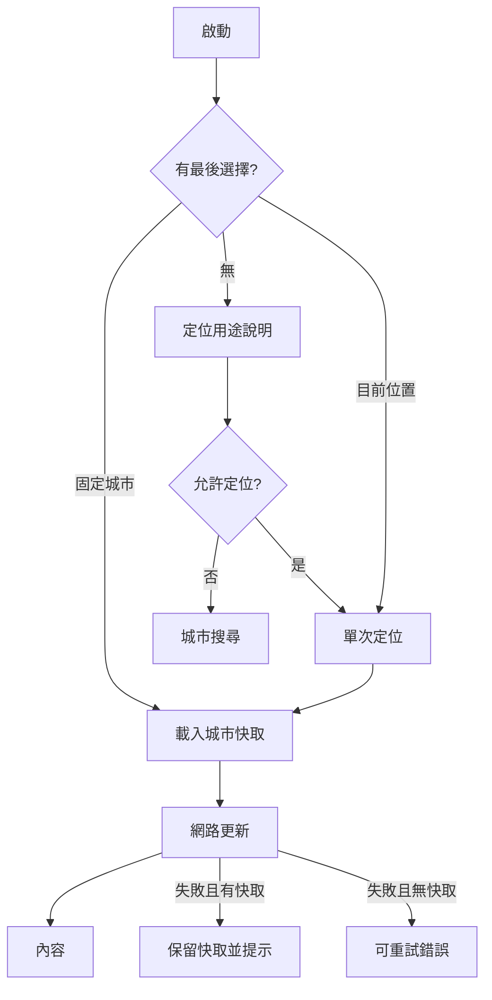

# 系統設計文件

## 設計目標

- 使用者拒絕定位後仍可完整查詢城市。
- 首次有快取時先顯示內容，再非阻斷更新。
- 外部服務或欄位缺漏不得造成 App 崩潰。
- 日期、日夜與預報標籤以查詢地點時區為準。
- 動畫不能降低可讀性或造成明顯耗電。

## UI 狀態模型

`WeatherUiState` 使用組合式欄位，而不是互斥的單一頁面狀態：

- `weather`：目前內容或快取。
- `isLoading`：無內容時首次載入。
- `isRefreshing`：保留內容更新。
- `isLocating`：正在取得位置。
- `needsPermission`、`locationUnavailable`：定位相關狀態。
- `message`：Snackbar 一次性提示。
- `searchQuery`、`searchResults`、`isSearching`、`searchError`：搜尋狀態。
- `favorites`、`showPlaceSheet`：收藏與 Bottom Sheet。

這種設計允許同時呈現「已有內容、正在更新、資料較舊或更新失敗」。

## 啟動流程

## 搜尋與收藏

- 輸入未滿 2 字元時不送出要求。
- 新輸入取消前一個搜尋 Job。
- 搜尋結果以 Open-Meteo ID 去重；缺 ID 時使用穩定 fallback ID。
- 收藏上限 20 個，超過時顯示提示且不覆蓋既有資料。
- 刪除正在查看的收藏不會清空目前內容。
- 最後選擇由 DataStore 保存。

## 日夜與圖示設計

- `WeatherApp` 每秒取得 `Instant.now()`，轉換為地點當地時間。
- 日出後至日落前使用淺色 Material scheme，其他時間使用深色 scheme。
- 系統狀態列與導覽列同步更新圖示明暗。
- `WeatherIcon` 將 WMO code 映射至太陽、月亮、局部多雲、雲、霧、雨、雪或雷雨。
- 圖示由 Compose Canvas 繪製，不依賴裝置 Emoji 字型。
- 背景動畫採 24 秒低幅度往返，並尊重系統動畫倍率為 0 的設定。

## 錯誤與降級策略

| 情境 | 行為 |
| --- | --- |
| 天氣 API 失敗且有快取 | 保留同地點快取並顯示 Snackbar |
| 天氣 API 失敗且無快取 | 顯示可重試錯誤 |
| 空氣品質 API 失敗 | 天氣正常顯示，空品欄位顯示 `--` |
| Geocoder 失敗 | 顯示「目前位置」，繼續查天氣 |
| 權限拒絕 | 提供重新定位、搜尋城市及系統設定 |
| GPS 關閉或逾時 | 顯示原因並允許搜尋城市 |
| API 選填欄位缺少 | 顯示 `--` 或隱藏，不崩潰 |
| 舊快取只有三日 | 顯示可用未來日期，更新後補齊大後天 |

## 安全與隱私

- 僅宣告網路及前景定位權限。
- 不使用背景定位、WorkManager 定時更新或持續位置監聽。
- 不包含 API Key、Token 或自建後端帳號。
- GPS 座標會傳送至 Open-Meteo 查詢資料。
- 精確移動軌跡不會保存；GPS 天氣只保留最後一次成功資料。
- Room 天氣資料已排除於 Android 完整備份。

## 非功能需求

- 主要互動區域至少 `48 dp`。
- 支援系統大字體與不同直式尺寸。
- 使用 Window Insets 避免瀏海、狀態列及導覽列遮擋。
- 快取讀取不依賴網路。
- 動畫使用簡單 Canvas 圖形，不載入影片或大型照片。
